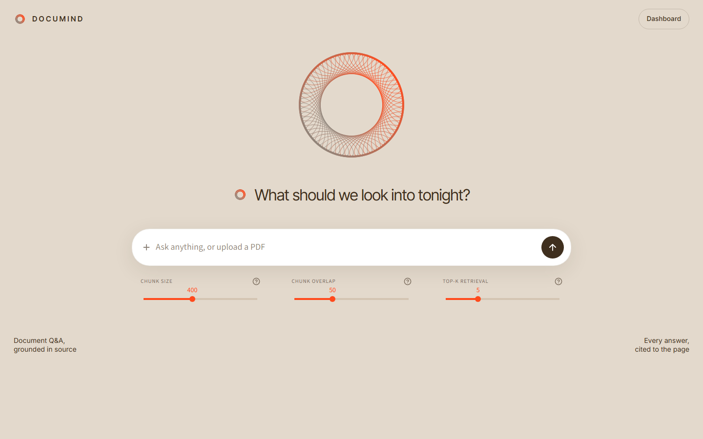
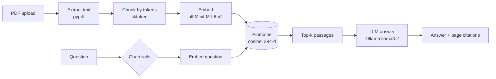

# DocuMind

**Ask your PDFs anything and get answers cited to the page.**

DocuMind is a retrieval-augmented generation (RAG) app for question answering over your own documents. Upload a PDF, ask a question in plain language, and get an answer grounded only in that document, with the exact pages it came from.



## Features

- **Answers with citations.** Every answer is built from retrieved passages, and each source is listed with its document, page number and match score.
- **One search bar.** Type a question or upload PDFs from the same input. The page switches into a conversation without navigating away.
- **Background indexing.** Large PDFs are indexed by a Celery worker, with live progress on the page. A question asked mid-indexing is answered automatically once the document is ready. With no worker running, indexing happens inline instead.
- **Guardrails.** Prompt-injection attempts and off-topic requests are blocked, PII is redacted, and questions that don't match the documents closely enough are refused rather than guessed.
- **Semantic cache.** Repeated or near-identical questions are answered from a Redis cache.
- **Evaluation and observability.** Faithfulness scoring, drift alerts, RAGAS evaluation, and a dashboard for cost, latency, token usage and cache hit rate.
- **Runs locally.** Embeddings run on your machine, and answers come from a local LLM via Ollama by default.

## How it works



1. **Ingest.** Text is extracted page by page, split into overlapping token chunks (chunk size and overlap are adjustable), embedded with `all-MiniLM-L6-v2`, and stored in a Pinecone serverless index along with the document name and page number.
2. **Retrieve.** The question passes the input guardrails, is embedded, and the top-k most similar chunks are fetched. If even the best match scores below the off-topic threshold, DocuMind says so instead of answering.
3. **Generate.** The passages are sent to the LLM with instructions to answer only from them and cite their sources. The answer streams back, and output checks run on the full answer.

The project was built in four phases, which map to the folder layout:

| Phase | What it adds | Where |
|---|---|---|
| 1. Core RAG | PDF ingestion, chunking, embeddings, Pinecone search, grounded generation | `core/` |
| 2. Async | Celery + Redis background ingestion with job progress | `phases/phase2_async/` |
| 3. Hardening | Guardrails, semantic cache, query logging, drift detection, RAGAS | `phases/phase3_hard/` |
| 4. Observability | SQLite metrics for tokens, cost, latency and cache hits | `phases/phase4_obs/` |

## Tech stack

Python · Streamlit · Pinecone · sentence-transformers · Ollama (OpenAI-compatible API) · Celery · Redis · RAGAS · pypdf · tiktoken · SQLite

## Getting started

### Prerequisites

- **Python 3.11+** (developed on 3.13)
- **A Pinecone account.** The free tier is enough, and the index is created automatically on first run.
- **[Ollama](https://ollama.com)** with a model pulled, e.g. `ollama pull llama3.2`. Any OpenAI-compatible endpoint also works; see `LLM_BASE_URL` below.
- *Optional:* **Redis** for background indexing and the semantic cache.
- *Optional:* an **OpenAI API key**, only needed for RAGAS evaluation.

### Install

```bash
git clone https://github.com/AK-I-RA/AI-Document-Intelligence.git
cd AI-Document-Intelligence

python -m venv venv
# Windows: venv\Scripts\activate    macOS/Linux: source venv/bin/activate
pip install -r requirements.txt
```

### Configure

Copy `.env.example` to `.env` and fill in your values:

| Variable | Required | Purpose |
|---|---|---|
| `PINECONE_API_KEY` | Yes | Pinecone access |
| `PINECONE_INDEX_NAME`, `PINECONE_CLOUD`, `PINECONE_REGION` | No | Index settings (default `documind`, `aws`, `us-east-1`) |
| `LLM_BASE_URL`, `LLM_MODEL` | No | Answer model endpoint (default local Ollama, `llama3.2`) |
| `LLM_API_KEY` | No | Key for a hosted OpenAI-compatible API such as Groq |
| `DEMO_MODE` | No | Set to `1` on a public deployment to hide the Dashboard |
| `REDIS_URL`, `CELERY_BROKER_URL`, `CELERY_RESULT_BACKEND` | No | Enable background indexing and caching |
| `OFFTOPIC_SCORE_THRESHOLD`, `CACHE_SIMILARITY_THRESHOLD` | No | Tuning (defaults `0.35`, `0.92`) |
| `OPENAI_API_KEY` | No | RAGAS evaluation only |

### Run

```bash
streamlit run ui/app.py
```

Open http://localhost:8501, upload a PDF with the upload button in the search bar, and start asking questions.

To index large PDFs in the background, start Redis, then run a worker in a second terminal:

```bash
celery -A phases.phase2_async.worker worker --loglevel=info --pool=solo
```

`--pool=solo` is needed on Windows. Without a worker, uploads are simply indexed inline.

## Deploy for free

DocuMind runs on [Streamlit Community Cloud](https://share.streamlit.io). A hosted server can't reach a local Ollama, so point it at a free OpenAI-compatible API such as [Groq](https://console.groq.com) instead. Background indexing is skipped there (no Redis), and PDFs are indexed inline.

1. Create a free Groq API key, and use a separate Pinecone index name for the public demo.
2. On share.streamlit.io, click **Create app** and pick this repo, branch `main`, main file `ui/app.py`. Under **Advanced settings**, choose Python 3.13 and paste your secrets:

   ```toml
   PINECONE_API_KEY = "your-pinecone-api-key"
   PINECONE_INDEX_NAME = "documind-demo"
   LLM_BASE_URL = "https://api.groq.com/openai/v1"
   LLM_MODEL = "llama-3.1-8b-instant"
   LLM_API_KEY = "your-groq-api-key"
   DEMO_MODE = "1"
   ```

3. Deploy. The first build takes a few minutes while dependencies and the embedding model download.

## Using the app

- **Search page.** Ask questions or upload PDFs from the search bar. Chunk size, chunk overlap and top-k retrieval can be adjusted right below it. Chunk settings apply to new uploads.
- **Dashboard** (top-right link). This view has four tabs:
  - **Job Queue:** background indexing jobs
  - **Eval:** faithfulness, drift alerts and RAGAS runs
  - **Dashboard:** cost, latency and usage charts
  - **Documents:** list or remove indexed documents

## Project structure

```
core/                  Phase 1 pipeline
  ingestion.py           PDF extraction and token chunking
  embeddings.py          sentence-transformers embeddings
  vector_store.py        Pinecone index: upsert, query, delete, stats
  generation.py          grounded prompt + streaming LLM answers
  pipeline.py            ingest_document / query_document orchestration
phases/
  phase2_async/          Celery app, ingestion task, job status
  phase3_hard/           guardrails, semantic cache, evaluation, RAGAS
  phase4_obs/            metrics store and call tracking
ui/
  app.py                 entry point and Dashboard view
  landing.py             search workspace (landing page)
  workflow.py            shared upload and indexing helpers
  brand.py               logo mark and time-of-day greeting
.streamlit/config.toml   theme
```
